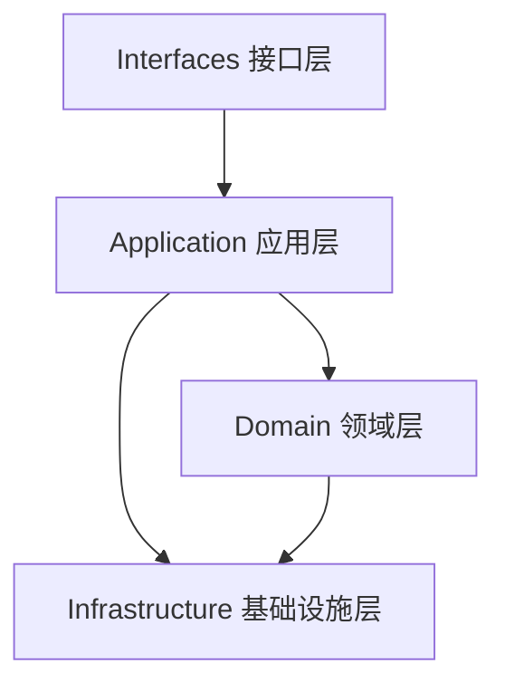

# ADR-001: 系统分层架构与领域驱动设计 (DDD)

## 状态
已修订通过 (2026-03-29)

## 上下文与问题描述
为了满足《AI 杭州旅游助手》系统对于高并发、微服务拆分、业务逻辑高内聚低耦合的需求，并便于后续可能的扩展（如从单体平滑过渡到微服务），系统需要明确各个模块的职责与边界。此前系统曾包含基于后端 SSR 的静态页面生成逻辑，但考虑到当前前端已全面转向基于 React 的纯 SPA (单页应用) 架构，需同步移除冗余的生成域，简化整体架构。

## 决策结果
我们采用 **领域驱动设计 (DDD) 结合洋葱/六边形架构思想的四层架构**。

### 1. 限界上下文划分 (Bounded Contexts)
系统被重构并划分为以下几个核心领域：
- **IAM (身份与访问管理)**: 聚合根：`User`。负责用户注册、登录、权限校验 (JWT/RBAC)、敏感信息哈希脱敏存储。
- **Chat (智能问答域)**: 聚合根：`ChatHistory`。负责多轮对话管理、Prompt 模板装配、对话历史记录存储 (30天清理策略)。
- **Tour & Content (旅游与内容域)**: 聚合根：`Attraction`, `GeneratedText`。负责景点管理、根据地点名称或景点信息调度大模型生成高质量旅游推文。
- **Geo (地理信息域)**: 无持久化实体。封装对高德 MCP Server 的调用，提供 POI 搜索与基于多种出行方式的路线规划。

### 2. 四层架构定义

1.  **Interfaces (接口层/HTTP Delivery)**:
    - 负责对外暴露 RESTful API (通过 Gin 路由组机制)。
    - 职责：路由分发、请求入参严格校验 (Binding)、统一格式响应 (JSON)、中间件 (CORS, JWT)。
2.  **Application (应用服务层/UseCase)**:
    - 负责编排业务用例（User Story），协调多个领域服务和资源库。
    - 职责：事务管理、DTO 与 Domain Entity 之间的转换。
3.  **Domain (领域层)**:
    - 系统最核心的业务逻辑所在，**绝对不依赖于外部任何框架或数据库**。
    - 包含：Entity (实体, 如 User, ChatHistory)、Value Object (值对象)、Aggregate Root (聚合根)、Domain Service (领域服务)、Repository Interfaces (仓储接口定义，如 `UserRepository`)。
4.  **Infrastructure (基础设施层/Repository & MCP)**:
    - 为其他层提供具体的技术实现。
    - 职责：数据库持久化 (GORM 封装 MySQL)、大模型调用 (Eino 封装 Ollama)、MCP 服务代理调用 (高德 API)。

### 3. 技术选型补充说明
-   **持久层框架**: GORM (支持 AutoMigrate 和事务控制)。
-   **模型编排框架**: CloudWeGo / Eino，用于无缝集成大模型推理。
-   **依赖注入**: 原生手动依赖注入 (DI) 于 `main.go` 中，保持启动流程清晰。
-   **API 网关**: Gin Engine 提供高性能 HTTP 路由服务。

## 变更记录
- **2026-03-24**: 初始版本，确立基于 gRPC 和生成器的架构。
- **2026-03-29**: 架构调整，移除 `Page Generator` 限界上下文，明确前端为纯 SPA 架构，废弃 gRPC 约束，全面转向轻量级 RESTful API。
